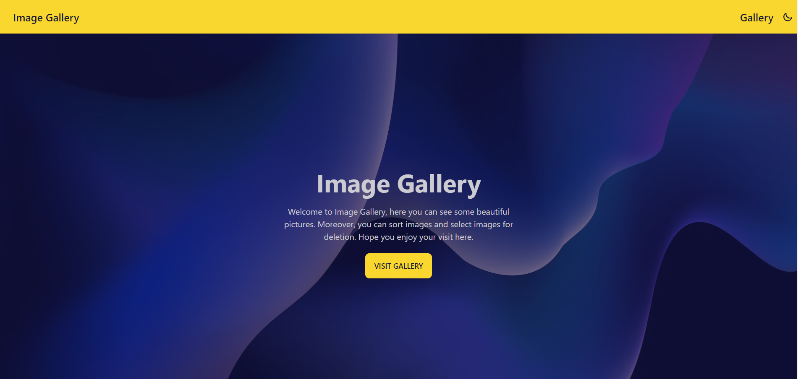
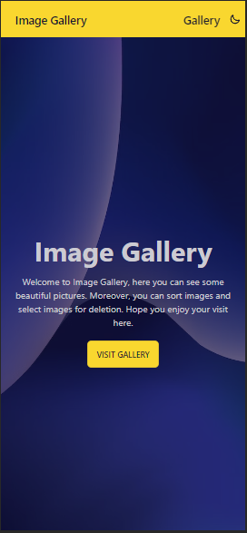
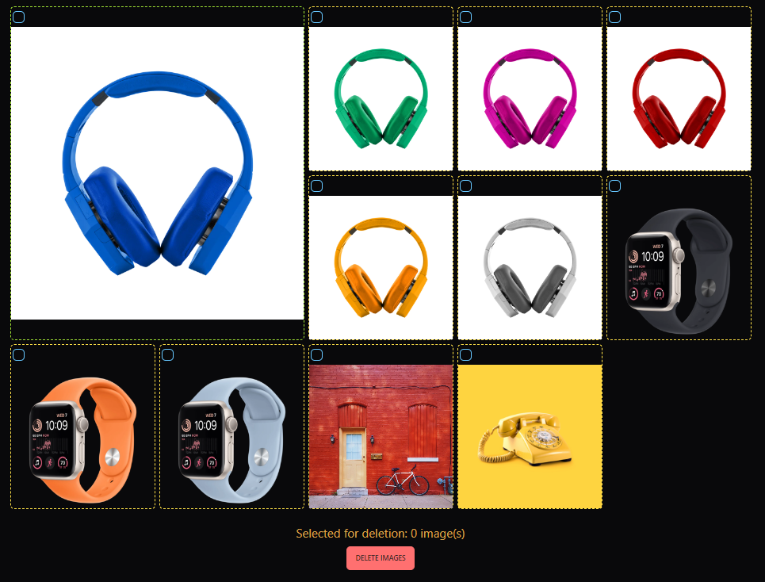
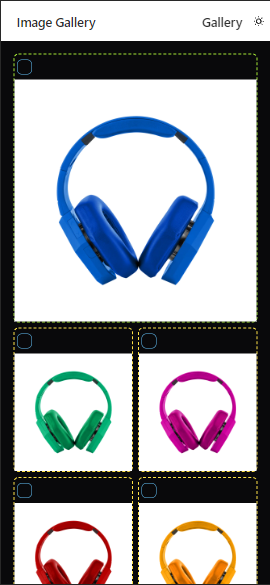

# Image Gallery with ReactJS 🌟

## Landing Page

First when the website is visited a simple landing page is shown, which contains a navbar with the name ImageGallery, gallery link and a switch to change theme. Furthermore, a welcome message is shown with a button to see the Image Gallery. The website is also responsive. Below are some images that contain snapshots of the website.

## Gallery Page

The next page is the Gallery Page. Here user can see all the images and also can interact with it like moving one image to another place select an image and delete all those selected images. Below is a snapshot of the page.

